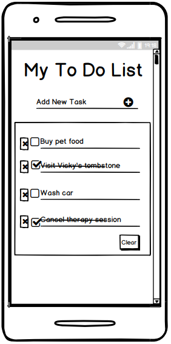
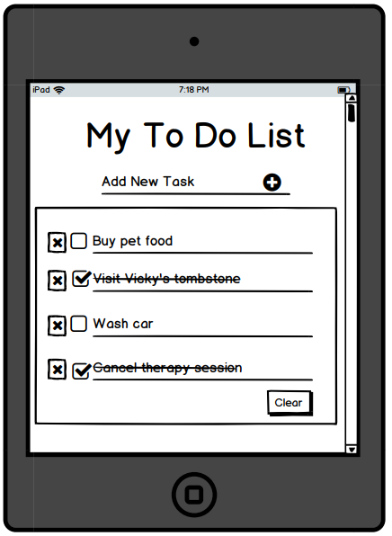
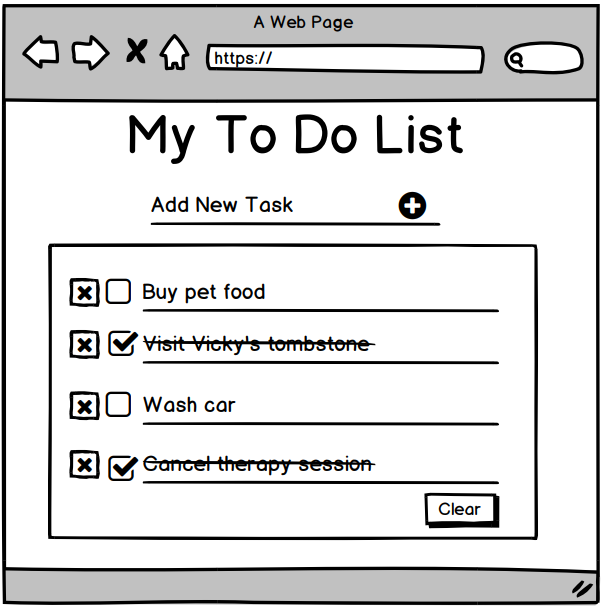

# To Do List
This is a to do list for adding tasks to be completed; on it. The aim of this project is to produce a website that users can use to create, read, update and delete tasks on a to do list. The tasks are created by typing inside the input field at the top. Afterwards when the plus button is clicked on, the tasks appear in the box underneath, along with a bin icon, to be viewed/read. The tasks can be clicked on to have a line drawn through it, indicating it has been updated and crossed off because it's been completed. The bin icon when clicked, deletes the respective task.

# UX
This website is for anyone who wishes to create a to do list to keep on track on the activities they are due to complete and help organise themselves in achieving such. The website is also accessible to users on different screen sizes to provide flexibility in the device used to access this website. 
## User stories:
- As a user, I want to create a task, so that I can document which activity I need to complete.
- As a user, I want to cross out a task, so I know which activity I have completed.
- As a user, I want to delete a completed task, so I know which activity I no longer want to complete.
## Designer stories:
- As the designer, I want to add an input field, so users can add tasks they need to complete.
- As the designer, I want to enable tasks being crossed out, so that users can know which tasks they've completed.
- As the designer, I want to enable deleting tasks, so users can remove tasks they are no longer interested in completing.
## Small Screens

## Medium Screens

## Large Screens

# Features
## Heading
- Provides title explaining what the website is and as a result tells users what they are to expect when using the website.
## Input Field
- Displays “**_Add New Task_**” as its placeholder to inform users this is the area where they are to type their task(s) they wish to add to the to do list.
- Once tasks are entered, the input field clears and displays only its placeholder text again.
## Input Field Button
- When clicked, the task typed in the input field is sent to the box underneath to be displayed. If there's nothing in the input field, then nothing will be sent to the box underneath if this button is clicked.
## Task Area
- This box area is where the task(s) entered in the input field is/are displayed. They appear with a bin icon. Also, a divider underneath to make the tasks easier to read when there are multiple tasks.
## Task Contents
- The tasks entered appear with a bin icon alongside them as well as a divider underneath, separating the different tasks from each other. When the bin icon is clicked, the task written beside it will be deleted. 

# Technologies Used
## HTML5
- This to do list used HTML5 to create the basic structure and layout of the website.
## CSS3
- This to do list used CSS3 to add design to the basic structure and layout of the website.
## [SASS](https://sass-lang.com/)
- This to do list used SASS to organise the added CSS3 design of the website.
## JavaScript
- This to do list used JavaScript to add functionality to the features of the website.
## [Font Awesome](https://fontawesome.com/)
- This to do list used Font Awesome to provide the icons used in the website.
## [Google Fonts](https://fonts.google.com/specimen/Indie+Flower?sidebar.open=true&selection.family=Indie+Flower)
- This to do list used Google Fonts to provide the font style of the website.
## [Chrome Development Tools](https://developers.google.com/web/tools/chrome-devtools)
- This to do list used Chrome Development Tools to see how responsive the website looked on different screen sizes.
- Also used to debug issues regarding editing CSS code taken from external frameworks and libraries.
## [W3C Markup Validation Service](https://validator.w3.org/)
- This to do list used W3C Markup Validation Service to check for errors, requiring correction, present in the HTML code of the website.
## [CSS Validation Service](https://jigsaw.w3.org/css-validator/)
- This to do list used CSS Validation Service to check for errors, requiring correction, present in the CSS code of the website.
## [VS Code](https://code.visualstudio.com/)
- This to do list used VS Code as the editor for coding out the README file, HTML, CSS, SASS and JavaScript portions of the website.
- External library and framework links, images and wireframes were also stored here.
## [GitHub](https://github.com/)
- This to do list used GitHub to store saved code of the website, as repositories.
## [Balsamiq Wireframes](https://balsamiq.com/)
- This to do list used Balsamiq Wireframes to create a mockup of what the website aimed to look like to the user, on completion.
## Snipping Tool
- This to do list used the Snipping Tool to edit the images and wireframes for the website.
## [HTML Formatter](https://www.freeformatter.com/html-formatter.html)
- This to do list used the HTML Formatter to format the HTML code used to make this website.
## [CSS Beautifier](https://www.freeformatter.com/css-beautifier.html)
- This to do list used the CSS Beautifier to beautify the CSS code used to make this website.
## [JavaScript Beautifier](https://www.freeformatter.com/javascript-beautifier.html)
- This to do list used the JavaScript Beautifier to beautify the JS code used to make this website.

# Testing
## Heading
- Using Chrome development tools, open the to do list website at the following different screen sizes: 320x571, 576Xx571, 1200x571 and 1366x571.
- Ensure the main title can be clearly seen across all these different screen sizes.
## Input Field
- Using Chrome development tools, open the to do list website at the following different screen sizes: 320x571, 576Xx571, 1200x571 and 1366x571.
- Ensure the input field and its placeholder text can be clearly seen across all these different screen sizes.
- Enter the word “**_Test_**” into the input field and ensure the placeholder text disappears; showing only the word “**_Test_**” being typed.  
## Input Field Button
- Using Chrome development tools, open the to do list website at the following different screen sizes: 320x571, 576Xx571, 1200x571 and 1366x571.
- Ensure the input field button can be clearly seen across all these different screen sizes.
- Press the input field's button with the input filed being empty to ensure nothing is sent to the text box area below.
- Enter the word “**_Test_**” into the input field and press the button to ensure the word “**_Test_**” is sent to the text box below along with the bin icon beside it.
## Task Area
- Using Chrome development tools, open the to do list website at the following different screen sizes: 320x571, 576Xx571, 1200x571 and 1366x571.
- Ensure the task box area can be clearly seen across all these different screen sizes.
## Task Contents
- Using Chrome development tools, open the to do list website at the following different screen sizes: 320x571, 576Xx571, 1200x571 and 1366x571.
- Ensure the task contents can be clearly seen across all these different screen sizes.
- Enter the word “**_Test_**” into the input field, press the input field's button and check the word “**_Test_**” and its bin icon is legible and both appear.
- Click on the task's text and ensure when clicked, the task's text is crossed off and when clicked, whilst being crossed off, the line through it disappears.
- Enter more tasks called “**_Test2_**”, “**_Test3_**” and “**_Test4_**” then click on the bin icon for the task called “**_Test_**” and ensure only this task is deleted from the task area.

# Deployment
This to do list was deployed following these steps:
1. First, the repository section on GitHub was entered and the to do list link containing the website and wireframes to be deployed, was clicked on.
2. Then, the settings tab underneath the “**_To-Do-List_**” heading, was clicked on to enter its settings.
3. Next, the settings page was then scrolled down until the sub-title “**_GitHub Pages_**” was found.
4. Later, under “**_GitHub Pages_**” a sub-title called “**_Source_**” was located. Under the “**_Source_**” sub-title was a button labelled “**_None_**”. This “**_None_**” button was clicked on to reveal a dropdown menu.
5. In the dropdown menu the option called “**_master branch_**” was selected.
6. After selecting the “**_master branch_**” option, the webpage refreshed automatically and deployed the website.
7. Finally, the link to this newly deployed website was taken from the “**_GitHub Pages_**” section.
## Running the code locally
This to do list was ran locally following these steps:
1. First enter the list of repositories section of GitHub.
2. Then, under the repository name of the to do list, click on the “**_Clone or download_**” button.
3. Next, when in the dropdown “**_Clone with HTTPS_**” section click the clipboard button next to the URL to copy the repository's clone URL.
4. Afterwards, enter into the local IDE and open Git Bash.
5. Then, change the current working directory into the location of where the cloned directory is to be made.
6. Next, type in “**_git clone_**” and paste in the URL that was copied earlier from the “**_Clone with HTTPS_**” section i.e.:
   1. git clone: https://github.com/VioletViolaVi/To_Do_List.git
7. Lastly, tap the enter button on the keyboard to create the local clone.

# Credits
## Content
- The responsive breakpoints used were taken from Bootstrap and my laptop screen size.
## Acknowledgements
I received inspiration for this to do list from:
- https://blog.usejournal.com/develop-a-to-do-list-app-in-vanilla-javascript-95377ec370c5?gi=6f17b77779
- https://www.youtube.com/watch?v=-pRg_daFjfk&ab_channel=learn-webdev
